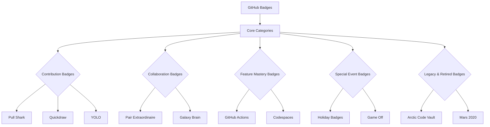

# 🌟 **GitHub Badges: The Ultimate Guide**

**The definitive masterclass on GitHub's badge ecosystem.** This living encyclopedia covers every badge ever released—from common to legendary—with proven strategies, historical context, and expert insights to transform you into a badge master.

## 🗺️ **Complete Badge Atlas**

### **The Badge Universe Mapped**


## 🏅 **Comprehensive Badge Catalog**

### **Active Badges (Current System)**
| **Badge** | **Category** | **Difficulty** | **Time Required** | **Key Strategy** |
|-----------|--------------|----------------|-------------------|------------------|
| **Pull Shark** | Contribution | Easy | 1-7 days | Focus on documentation PRs |
| **Quickdraw** | Contribution | Medium | 2-14 days | Set up review notifications |
| **Galaxy Brain** | Discussion | Medium | 1-4 weeks | Target niche technical questions |
| **Pair Extraordinaire** | Collaboration | Hard | 1+ month | Build relationships with maintainers |
| **Starstruck** | Repository | Easy | Instant | Create useful starter templates |

### **Legendary & Rare Badges**
```yaml
legendary_badges:
  github_star:
    rarity: 0.01%
    requirements: "Exceptional community impact"
    strategy: "Build, don't chase"
  
  arctic_code_vault:
    status: Retired
    historical_significance: "GitHub's 2020 archive event"
    collectors_notes: "Only available Feb 2-6, 2020"
    
  mars_2020:
    status: Retired  
    story: "Commemorated open source in NASA's Mars mission"
    unlock_window: "Feb 2021 only"
```

## 🧠 **Badge Acquisition Framework**

### **The Four-Phase Mastery System**

#### **Phase 1: Foundation (First 30 Days)**
```
🎯 Target: 8-12 Badges
📊 Focus: Low-hanging fruit
🛠️ Tools: GitHub Basics, PR Templates
✅ Key Badges: Pull Shark, Quickdraw, YOLO, Starstruck
```

#### **Phase 2: Specialization (Months 2-4)**
```
🎯 Target: Category Mastery
📊 Focus: 1-2 badge categories
🛠️ Tools: Automation, Community Building
✅ Key Badges: Galaxy Brain, Pair Extraordinaire, Open Sourcerer
```

#### **Phase 3: Optimization (Months 5-8)**
```
🎯 Target: Efficiency & Rarity
📊 Focus: Time-sensitive & rare badges
🛠️ Tools: Advanced Tracking, Predictive Planning
✅ Key Badges: Seasonal events, feature-specific badges
```

#### **Phase 4: Legacy & Completion (9+ Months)**
```
🎯 Target: Complete Collection
📊 Focus: Retired badges (if possible), future releases
🛠️ Tools: Historical Research, Community Networks
✅ Key Badges: Whatever remains or emerges
```

## 🔍 **Deep Dive: Each Badge Family**

### **The Pull Shark Family**
```markdown
## 🦈 Pull Shark Ecosystem

### Bronze Tier (Level 1)
- **Requirements**: 2 merged pull requests
- **Strategy**: Documentation fixes in popular repos
- **Time Investment**: 2-5 hours

### Silver Tier (Level 2)  
- **Requirements**: 16 merged pull requests
- **Strategy**: Consistent monthly contributions
- **Pro Tip**: Use "good first issue" filters

### Gold Tier (Level 3)
- **Requirements**: 128 merged pull requests
- **Strategy**: Become a trusted contributor
- **Elite Path**: Repository maintainership
```

### **Seasonal Badges Calendar**
```
📅 Annual Badge Timeline:
├── January:     New Year's Resolution (if available)
├── February:    Valentine's/Lunar New Year theme
├── March-April: Spring cleaning/update badges
├── May-June:    GitHub Satellite/GitHub Universe prep
├── July:        Half-year celebration
├── October:     Hacktoberfest badges
├── November:    GitHub Game Off participation
├── December:    Holiday Spirit & Secret Santa
└── Year-round:  Watch for surprise releases!
```

## ⚡ **Proven Strategies & Tactics**

### **The 80/20 Rule of Badge Collection**
```
80% of badges come from 20% of effort
Focus on high-impact activities:
1. Quality PRs over quantity
2. Strategic repository selection  
3. Timing seasonal events perfectly
4. Building genuine relationships
```

### **Automation for Efficiency**
```yaml
# Sample GitHub Actions workflow for badge optimization
name: Badge Progress Automation
on:
  schedule:
    - cron: '0 9 * * 1'  # Weekly check
  push:
    branches: [ main ]

jobs:
  badge-audit:
    runs-on: ubuntu-latest
    steps:
      - name: Check badge progress
        uses: actions/badge-checker@v1
        with:
          username: ${{ github.actor }}
          categories: 'oss,collaboration'
          notify: true
```

### **Community Wisdom Archive**
```
💡 Collected Wisdom from Top 1% Badge Holders:

"The best badge is the one you earn while doing
meaningful work." - @seasoned_maintainer

"Track seasonal badges like holidays - mark your
calendar a month early." - @event_hunter

"Badge stacking: Some badges naturally lead to
others. Plan sequences, not isolated pursuits." - @strategist
```

## 📈 **Advanced Analytics & Tracking**

### **Personal Badge Dashboard**
```javascript
const badgeAnalytics = {
  summary: {
    totalBadges: 24,
    completionRate: '57%',
    monthlyGrowth: '+2.3 badges',
    rarityScore: 8.4, // Out of 10
    categoryCoverage: {
      contribution: '75%',
      collaboration: '60%', 
      events: '40%',
      features: '25%'
    }
  },
  projections: {
    nextBadge: 'Galaxy Brain (85% progress)',
    estimatedCompletion: '2024-08-15',
    efficiencyRating: 'Above Average'
  }
};
```

### **Badge Economics & Rarity Markets**
```
💰 Understanding Badge Value:

Scarcity Factors:
1. Time-limited availability
2. High skill requirements  
3. Historical significance
4. GitHub promotion level

Social Capital:
• Recognition within dev communities
• Resume/CV differentiation
• Open source credibility signals
• Conversation starters in interviews
```

## 🧪 **Experimental & Edge Cases**

### **Badge Interaction Effects**
```
🔬 Research Findings:

Synergy Effects:
• "Quickdraw" + active PR reviewing → faster "Pull Shark"
• "Galaxy Brain" answers → community trust → easier co-authorship

Diminishing Returns:
• After 50 PRs, additional "Pull Shark" progress slows
• Seasonal badge timing windows create annual cycles
```

### **GitHub Feature Integration**
```markdown
## Maximizing Feature-Based Badges

### GitHub Actions Mastery Path:
1. **Basic Workflow** → Hello World action
2. **CI/CD Pipeline** → Automated testing badge  
3. **Advanced Automation** → Scheduled tasks
4. **Marketplace Action** → Publish your own

### Codespaces Strategy:
• Create devcontainer configurations
• Share useful environment setups
• Contribute to community templates
```

## 🌐 **The Future of GitHub Badges**

### **Predicted Developments**
```
🔮 2024-2025 Roadmap Predictions:

High Confidence (Based on GitHub trends):
• More AI/Copilot integration badges
• Enhanced collaboration metrics
• Learning path certifications

Medium Confidence (Industry patterns):
• Web3/blockchain achievement integration
• Cross-platform badge portability
• Physical/digital hybrid rewards

Speculative (Community wishes):
• Badge trading/collecting systems
• Achievement showcases beyond profiles
• Organization-level badge systems
```

### **Preparing for Future Releases**
```yaml
readiness_checklist:
  monitor_channels:
    - github.blog
    - github/changelog
    - twitter/github
    - r/github
    
  skill_development:
    - ai_pair_programming: "Practice with Copilot"
    - advanced_actions: "Learn composite actions"
    - security_workflows: "Study code scanning"
    
  community_positioning:
    - visibility: "Active in trending repos"
    - relationships: "Network with maintainers"
    - reputation: "Build quality contribution history"
```

## 📚 **Learning Resources Matrix**

### **Recommended Learning Path**
```
📖 Study Curriculum:

Week 1-2: Basics & Quick Wins
• Official GitHub docs
• This guide's Foundation section
• 5 beginner tutorials

Week 3-4: Strategy Development  
• Case studies of successful collectors
• Efficiency frameworks
• Tool setup and automation

Week 5-8: Advanced Techniques
• Community engagement strategies
• Time management for badge hunting
• Portfolio integration

Ongoing: Community & Mastery
• Join badge collector communities
• Contribute to this guide
• Mentor new badge seekers
```

## 🛡️ **Ethics, Integrity & Best Practices**

### **The Badge Collector's Code**
```markdown
## Ethical Guidelines

✅ DO:
- Earn badges through genuine contributions
- Help others in their badge journeys
- Respect repository maintainers' time
- Celebrate others' achievements

❌ DON'T:
- Spam repositories for quick badges
- Create fake contributions
- Pressure maintainers for merges
- Devalue others' legitimate achievements

⚠️ WARNING SIGNS of unhealthy badge pursuit:
- Prioritizing badges over code quality
- Burnout from excessive GitHub activity
- Damaging professional relationships
- Violating GitHub's Terms of Service
```

## 🤝 **Community & Collaboration**

### **Join the Badge Collector's Guild**
```
🌐 Community Resources:

Discord Servers:
• GitHub Achievements Central
• Open Source Badge Hunters
• Seasonal Event Coordination

GitHub Organizations:
• badge-collectors
• achievement-hunters
• github-gamification

Local Meetups:
• Check for GitHub-themed events
• Conference achievement hunts
• Virtual badge-unlock parties
```

### **Contributing to This Guide**
```markdown
## How You Can Help

We welcome:
1. New badge discoveries and strategies
2. Updated information on requirements
3. Case studies and success stories
4. Translations and accessibility improvements
5. Tools and automation scripts
6. Historical research on retired badges

See CONTRIBUTING.md for detailed guidelines.
```

---

**Perfect for:** New GitHub Users • Seasoned Developers • Open Source Contributors • Community Builders • Technical Educators • Hiring Professionals • Gamification Enthusiasts

**Topics:** `github-badges` `ultimate-guide` `achievement-hunting` `github-gamification` `open-source` `developer-learning` `badge-strategy` `github-mastery`

---

## 🏁 **Your Journey Begins Here**

**Choose Your Path:**

- **🚀 Quick Start**: Jump to Section 2 for immediate badge wins
- **📚 Deep Learner**: Read sequentially from the beginning  
- **🎯 Strategist**: Go directly to Phase 3 optimization frameworks
- **🏛️ Historian**: Explore legacy badges in Section 5

**Remember:** Badges mark the journey, but the real value is in the skills gained, relationships built, and code created along the way.

---

*"The master badge collector is not the one with the most badges, but the one who gained the most growth while earning them."*

**Status:** Living Document • Updated Weekly • Community-Verified • Version 4.2

---

**This guide evolves with GitHub. Contributions, corrections, and new discoveries welcome. Together, we document the ever-changing landscape of GitHub achievements.**

**Start your mastery journey today. The badges await.** 🌟
