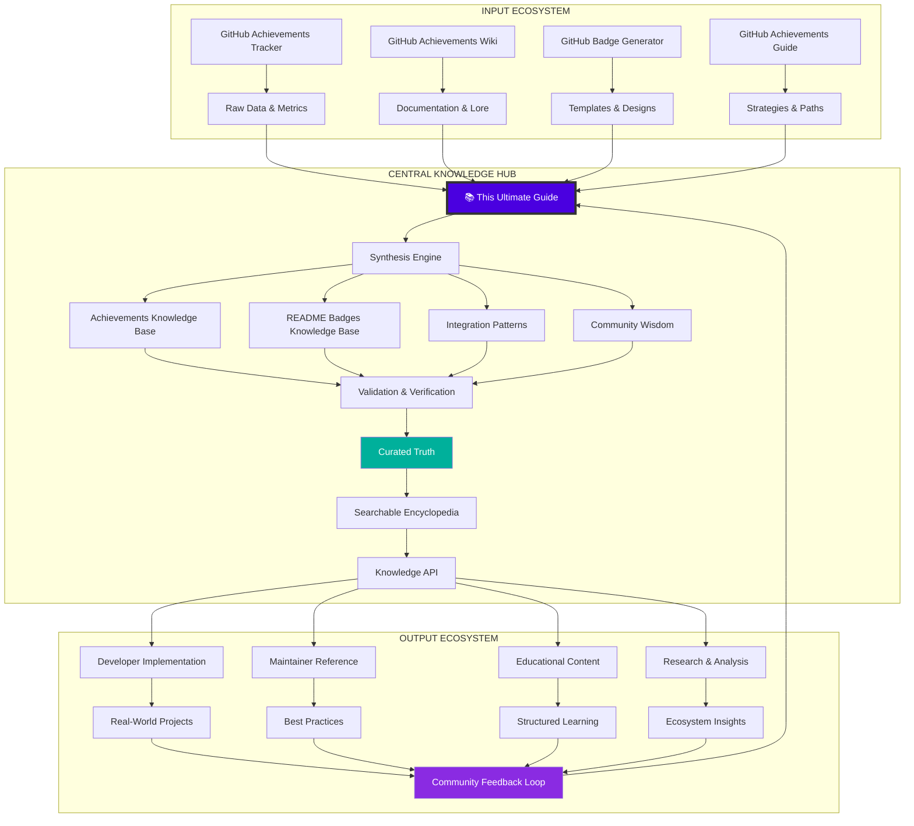
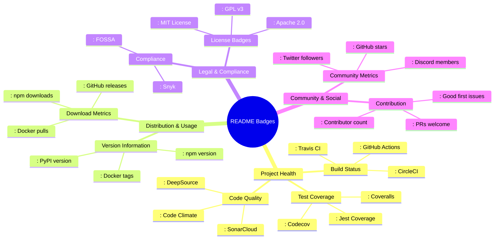
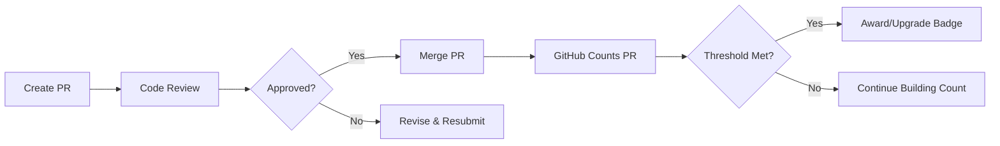
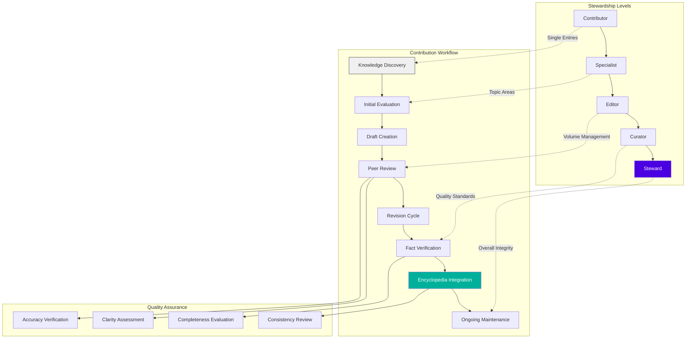

/*
 Copyright (c) 2026 Ashraf Morningstar
 These are personal recreations of existing projects, developed by Ashraf Morningstar
 for learning and skill development.
 Original project concepts remain the intellectual property of their respective creators.
 Repository: https://github.com/AshrafMorningstar
*/

# 🏆 GitHub Badges Ultimate Guide: The Master Encyclopedia

<div align="center">


# 🌌 **The Complete Encyclopedia of GitHub Badges & Achievements**

### **From Profile Recognition to README Mastery: One Unified Source of Truth**

[](https://github.com/AshrafMorningstar/GitHub-Badges-Ultimate-Guide/wiki)
[](https://ashrafmorningstar.github.io/GitHub-Badges-Ultimate-Guide/)
[](CONTRIBUTING.md)


</div>

## 🏛️ Introduction: The Central Nervous System of GitHub Visual Identity

Welcome to the **GitHub Badges Ultimate Guide**, the definitive encyclopedia that synthesizes, organizes, and elevates every dimension of GitHub's visual recognition ecosystem. This isn't merely another guide—it's the **central knowledge repository**, the **interconnection hub**, and the **authoritative reference** that unifies all badge-related wisdom into one cohesive, searchable, master resource.

### 🎯 **The Encyclopedia Mission**

> "Information scattered is knowledge lost. This encyclopedia exists to **centralize, validate, and connect** every fragment of badge-related knowledge—transforming isolated facts into interconnected understanding, transforming curiosity into mastery."

## 🌐 The Complete Ecosystem Architecture



## 📚 Encyclopedia Structure: The Complete Taxonomy

### Volume I: Profile Recognition Systems

#### 📖 Chapter 1: GitHub-Awarded Achievements
*Automated recognition for community contributions*

| Category | Badges Included | Core Philosophy | Mastery Progression |
|----------|-----------------|-----------------|---------------------|
| **Collaboration** | Pull Shark, Pair Extraordinaire | "Together we build better" | Bronze → Silver → Gold |
| **Responsiveness** | Quickdraw, Discussion Answerer | "The community moves at speed" | First response → Consistent speed |
| **Quality Focus** | YOLO, Starstruck | "Excellence attracts attention" | Good → Great → Exceptional |
| **Community Building** | Galaxy Brain, Public Sponsor | "We rise by lifting others" | Participant → Contributor → Leader |
| **Historical Legacy** | Arctic Code Vault, Mars 2020 | "Yesterday's work powers tomorrow" | Contemporary → Historical perspective |

#### 📖 Chapter 2: Status & Program Indicators
*Visual markers of participation and membership*

| Indicator Type | Examples | Significance | Visibility Impact |
|----------------|----------|--------------|-------------------|
| **Subscription** | GitHub Pro | Professional commitment | High (Premium placement) |
| **Security** | Bug Bounty Hunter, Advisory Credit | Security expertise | High (Trust signal) |
| **Education** | Campus Expert | Student leadership | Medium (Niche recognition) |
| **Developer** | Developer Program Member | Platform expertise | Medium (Technical credibility) |

### Volume II: Developer-Created Visual Systems

#### 📖 Chapter 3: README Badge Typology
*A comprehensive classification system*



#### 📖 Chapter 4: Dynamic & Smart Badges
*Badges that think, adapt, and communicate*

| Intelligence Level | Capabilities | Implementation | Example Use Case |
|-------------------|--------------|----------------|------------------|
| **Basic Static** | Fixed text, color | Direct Markdown | License badge |
| **Data-Aware** | Updates with external data | Shields.io with API | Latest version badge |
| **Conditional** | Changes based on thresholds | Custom endpoints | Coverage color coding |
| **Predictive** | Forecasts trends | ML integration | Project health forecast |
| **Interactive** | User can interact | JavaScript embed | Click-to-expand details |

### Volume III: Integration & Synergy Patterns

#### 📖 Chapter 5: Holistic Profile Design
*How all visual elements work together*

```yaml
# Optimal Profile Configuration
profile_design:
  achievements_strategy:
    primary_focus: "Collaboration & Quality"
    secondary_focus: "Community Leadership"
    display_priority: ["Pull Shark", "Galaxy Brain", "Starstruck"]
  
  highlights_positioning:
    premium_placement: "GitHub Pro"
    credibility_signals: ["Security Advisory Credit"]
    community_signals: ["Campus Expert"]
  
  readme_integration:
    top_section: "Project Health & Quick Stats"
    middle_section: "Tech Stack & Skills"
    bottom_section: "Community & Contribution"
  
  visual_hierarchy:
    primary_color: "#24292e" # GitHub Dark
    secondary_color: "#0366d6" # GitHub Blue
    accent_color: "#2ea44f" # GitHub Green
    badge_density: "Optimal (7-12 key badges)"
    
  narrative_flow:
    story_arc: "Skilled Collaborator → Community Leader → Innovator"
    evidence_points: ["PRs merged", "Discussions led", "Projects starred"]
```

## 🏗️ Encyclopedia Knowledge Architecture

```
GitHub-Badges-Ultimate-Guide/
│
├── 📂 VOLUMES/                          # Major knowledge divisions
│   ├── 📁 volume-i-profile-systems/
│   │   ├── 📚 chapter-1-achievements/
│   │   │   ├── 📖 section-1-collaboration/
│   │   │   │   ├── entry-pull-shark.md
│   │   │   │   ├── entry-pair-extraordinaire.md
│   │   │   │   └── comparative-analysis.md
│   │   │   ├── 📖 section-2-responsiveness/
│   │   │   ├── 📖 section-3-quality/
│   │   │   └── 📖 section-4-community/
│   │   │
│   │   └── 📚 chapter-2-status-indicators/
│   │       ├── entry-github-pro.md
│   │       ├── entry-security-badges.md
│   │       └── entry-education-programs.md
│   │
│   ├── 📁 volume-ii-developer-systems/
│   │   ├── 📚 chapter-3-badge-typology/
│   │   │   ├── taxonomy-framework.md
│   │   │   ├── classification-system.md
│   │   │   └── visual-dictionary.md
│   │   ├── 📚 chapter-4-dynamic-badges/
│   │   │   ├── smart-badge-architecture.md
│   │   │   ├── implementation-guides.md
│   │   │   └── advanced-patterns.md
│   │   └── 📚 chapter-5-design-systems/
│   │       ├── visual-hierarchy.md
│   │       ├── color-theory.md
│   │       └── layout-principles.md
│   │
│   ├── 📁 volume-iii-integration/
│   │   ├── 📚 chapter-6-holistic-design/
│   │   │   ├── profile-narratives.md
│   │   │   ├── repository-strategies.md
│   │   │   └── career-storytelling.md
│   │   └── 📚 chapter-7-ecosystem-analysis/
│   │       ├── platform-evolution.md
│   │       ├── future-trends.md
│   │       └── impact-studies.md
│   │
│   └── 📁 volume-iv-reference/
│       ├── 📚 chapter-8-complete-index/
│       ├── 📚 chapter-9-cross-references/
│       └── 📚 chapter-10-methodology/
│
├── 📂 KNOWLEDGE-BASES/                  # Specialized knowledge collections
│   ├── 📁 achievements-database/
│   │   ├── complete-list.json
│   │   ├── historical-archive.json
│   │   ├── criteria-verification.json
│   │   └── progression-data.json
│   │
│   ├── 📁 badges-database/
│   │   ├── service-catalog.json
│   │   ├── template-library.json
│   │   ├── design-systems.json
│   │   └── performance-metrics.json
│   │
│   ├── 📁 integration-patterns/
│   │   ├── successful-examples.json
│   │   ├── failure-analysis.json
│   │   ├── optimization-tips.json
│   │   └── case-study-index.json
│   │
│   └── 📁 community-wisdom/
│       ├── contributed-insights.json
│       ├── expert-opinions.json
│       ├── myth-debunking.json
│       └── emerging-practices.json
│
├── 📂 INTERACTIVE-TOOLS/                # Knowledge exploration tools
│   ├── 📁 search-engine/
│   │   ├── full-text-search.js
│   │   ├── semantic-search.js
│   │   └── visual-search.js
│   │
│   ├── 📁 knowledge-graph/
│   │   ├── graph-explorer.js
│   │   ├── relationship-mapper.js
│   │   └── connection-finder.js
│   │
│   ├── 📁 comparison-tools/
│   │   ├── badge-comparator.js
│   │   ├── strategy-analyzer.js
│   │   └── impact-calculator.js
│   │
│   └── 📁 learning-paths/
│       ├── path-generator.js
│       ├── progress-tracker.js
│       └── mastery-evaluator.js
│
├── 📂 VALIDATION-SYSTEMS/               # Quality assurance systems
│   ├── 📁 verification-framework/
│   │   ├── fact-checker.js
│   │   ├── source-validator.js
│   │   └── accuracy-scorer.js
│   │
│   ├── 📁 consistency-checks/
│   │   ├── cross-reference-checker.js
│   │   ├── contradiction-detector.js
│   │   └── update-tracker.js
│   │
│   └── 📁 quality-metrics/
│       ├── completeness-calculator.js
│       ├── clarity-scorer.js
│       └── usefulness-evaluator.js
│
└── README.md                            # This master entry point
```

## 🔍 The Encyclopedia Navigation System

### Intelligent Search & Discovery
```javascript
// Encyclopedia Search Algorithm
class EncyclopediaSearch {
  constructor(knowledgeBase) {
    this.knowledge = knowledgeBase;
    this.index = this.buildSemanticIndex();
  }

  buildSemanticIndex() {
    // Multi-dimensional indexing for comprehensive discovery
    return {
      by_topic: this.indexByTopic(),
      by_skill_level: this.indexByDifficulty(),
      by_relationship: this.indexByConnections(),
      by_timeline: this.indexChronologically(),
      by_visual_type: this.indexVisually()
    };
  }

  search(query, options = {}) {
    const results = {
      exact_matches: this.findExactMatches(query),
      conceptual_matches: this.findConceptualMatches(query),
      related_concepts: this.findRelatedConcepts(query),
      learning_paths: this.findLearningPaths(query),
      visual_examples: this.findVisualExamples(query)
    };

    return this.rankResults(results, options);
  }

  exploreRelationships(topic) {
    // Visualize knowledge connections
    return {
      prerequisites: this.findPrerequisites(topic),
      core_concepts: this.findCoreConcepts(topic),
      advanced_topics: this.findAdvancedTopics(topic),
      practical_applications: this.findApplications(topic),
      community_discussions: this.findDiscussions(topic)
    };
  }
}
```

### Knowledge Visualization Interface

```mermaid
graph TB
    subgraph "Encyclopedia Navigation Interface"
        HOME[Encyclopedia Home] --> SEARCH[Intelligent Search]
        HOME --> BROWSE[Structured Browse]
        HOME --> EXPLORE[Relationship Explorer]
        HOME --> LEARN[Learning Paths]
        
        SEARCH --> RESULTS[Multi-Faceted Results]
        RESULTS --> DETAIL[Detailed Entry]
        
        BROWSE --> VOLUMES[Volume Selection]
        VOLUMES --> CHAPTERS[Chapter Navigation]
        CHAPTERS --> SECTIONS[Section Detail]
        SECTIONS --> ENTRIES[Individual Entries]
        
        EXPLORE --> GRAPH[Knowledge Graph]
        GRAPH --> CONNECTIONS[Connection Mapping]
        CONNECTIONS --> INSIGHTS[Relationship Insights]
        
        LEARN --> PATHS[Curated Learning Paths]
        PATHS --> MODULES[Interactive Modules]
        MODULES --> EXERCISES[Practical Exercises]
        EXERCISES --> VALIDATION[Knowledge Validation]
    end
    
    subgraph "Entry Detail View"
        DETAIL --> HEADER[Entry Header]
        DETAIL --> CONTENT[Main Content]
        DETAIL --> METADATA[Metadata & Sources]
        DETAIL --> RELATIONS[Related Entries]
        DETAIL --> ACTIONS[Actions & Tools]
        
        HEADER --> TITLE[Title & Classification]
        HEADER --> VISUAL[Visual Representation]
        HEADER --> SUMMARY[Quick Summary]
        
        CONTENT --> DEFINITION[Formal Definition]
        CONTENT --> EXPLANATION[Detailed Explanation]
        CONTENT --> EXAMPLES[Practical Examples]
        CONTENT --> IMPLEMENTATION[Implementation Guide]
        
        METADATA --> SOURCES[Verified Sources]
        METADATA --> HISTORY[Revision History]
        METADATA --> STATISTICS[Usage Statistics]
        
        RELATIONS --> PREREQS[Prerequisites]
        RELATIONS --> RELATED[Related Topics]
        RELATIONS --> ADVANCED[Advanced Concepts]
        
        ACTIONS --> SAVE[Save for Later]
        ACTIONS --> SHARE[Share Entry]
        ACTIONS --> EXPORT[Export Content]
        ACTIONS --> FEEDBACK[Provide Feedback]
    end
    
    style HOME fill:#4a00e0,color:#fff
    style DETAIL fill:#00b09b,color:#fff
```


## 🎨 Encyclopedia Design System

### Premium Visual Architecture
```css
/* Encyclopedia Design Tokens */
:root {
  /* Knowledge-Focused Color System */
  --knowledge-primary: #4a00e0;      /* Core wisdom */
  --knowledge-secondary: #8a2be2;    /* Connected understanding */
  --knowledge-accent: #00b09b;       /* Verified truth */
  --knowledge-neutral: #2d3748;      /* Foundation */
  --knowledge-highlight: #ffd700;    /* Key insights */
  
  /* Typography Hierarchy */
  --font-encyclopedia: 'Merriweather', 'Georgia', serif;
  --font-entry-title: 'Playfair Display', serif;
  --font-code-samples: 'JetBrains Mono', 'Fira Code', monospace;
  --font-ui-elements: 'Inter', -apple-system, sans-serif;
  
  /* Spacing System */
  --space-knowledge: 2.5rem;
  --space-reading: 1.8rem;
  --space-focus: 1.2rem;
  --space-detail: 0.8rem;
  
  /* Visual Effects */
  --shadow-encyclopedia: 0 25px 100px -20px rgba(0, 0, 0, 0.3);
  --shadow-entry: 0 10px 40px rgba(0, 0, 0, 0.1);
  --glow-highlight: 0 0 30px rgba(255, 215, 0, 0.3);
  
  /* Animation Library */
  --transition-knowledge: all 0.4s cubic-bezier(0.4, 0, 0.2, 1);
  --transition-focus: all 0.2s cubic-bezier(0.4, 0, 0.2, 1);
}

/* Encyclopedia Entry Components */
.encyclopedia-entry {
  background: linear-gradient(145deg, 
    rgba(255, 255, 255, 0.95) 0%, 
    rgba(255, 255, 255, 0.98) 100%);
  border-radius: 20px;
  box-shadow: var(--shadow-entry);
  border: 1px solid rgba(0, 0, 0, 0.08);
  transition: var(--transition-knowledge);
}

.encyclopedia-entry:hover {
  transform: translateY(-5px);
  box-shadow: var(--shadow-encyclopedia);
}

.entry-header {
  background: linear-gradient(135deg, 
    var(--knowledge-primary) 0%, 
    var(--knowledge-secondary) 100%);
  color: white;
  border-radius: 20px 20px 0 0;
  padding: var(--space-knowledge);
}

.knowledge-graph-node {
  background: white;
  border: 2px solid var(--knowledge-accent);
  border-radius: 50%;
  box-shadow: 0 0 0 4px rgba(0, 176, 155, 0.1);
  transition: var(--transition-focus);
}

.knowledge-graph-node.active {
  box-shadow: 0 0 0 8px rgba(0, 176, 155, 0.2),
              var(--glow-highlight);
  transform: scale(1.1);
}
```

## 🛠️ Practical Implementation Framework

### Encyclopedia Entry Template System
```yaml
# Standard Encyclopedia Entry Structure
entry_template:
  metadata:
    entry_id: "format: VOLUME.CHAPTER.SECTION.ENTRY"
    title: "Clear, Descriptive Title"
    subtitle: "Brief explanatory subtitle"
    classification:
      - primary_category: "e.g., Profile Achievement"
      - secondary_categories: ["Collaboration", "Quality"]
      - difficulty_level: "Beginner/Intermediate/Advanced"
      - last_verified: "YYYY-MM-DD"
    
  content_structure:
    definition:
      formal_definition: "Precise, technical definition"
      plain_language: "Accessible explanation"
      key_characteristics: ["List of defining features"]
    
    detailed_explanation:
      how_it_works: "Mechanisms and processes"
      significance: "Why this matters"
      common_misconceptions: "What people often get wrong"
    
    practical_implementation:
      step_by_step_guide: "Actionable instructions"
      code_examples: "Implementable code snippets"
      best_practices: "Proven successful approaches"
    
    visual_references:
      screenshots: "Real GitHub examples"
      diagrams: "Explanatory visuals"
      before_after: "Comparison examples"
    
    verification_sources:
      official_documentation: "GitHub source links"
      community_verification: "Multiple confirmations"
      historical_evidence: "Evolution and changes"
    
  relationships:
    prerequisites: ["Required knowledge/skills"]
    related_entries: ["Closely connected topics"]
    advanced_topics: ["Next level concepts"]
    practical_applications: ["Real-world uses"]
    
  interactive_elements:
    learning_check: "Quick knowledge check"
    implementation_exercise: "Hands-on practice"
    further_exploration: "Additional resources"
```

### Knowledge Integration Example
```markdown
# 📖 Encyclopedia Entry: Pull Shark Achievement

## 🎯 Quick Summary
**Pull Shark** is GitHub's achievement for successful pull request collaboration, awarded in tiers based on the number of merged PRs.

## 📊 Classification
- **Type**: Profile Achievement
- **Category**: Collaboration
- **Difficulty**: Beginner to Expert
- **Tiers**: Bronze (2), Silver (16), Gold (128)

## 🏗️ How It Works


## 🛠️ Implementation Strategy
### Bronze Tier (First 2 PRs)
1. **Start Simple**: Fix documentation typos
2. **Choose Friendly Repos**: Look for "good first issue" labels
3. **Follow Guidelines**: Read CONTRIBUTING.md carefully

### Silver Tier (Next 14 PRs)
1. **Increase Complexity**: Small features, bug fixes
2. **Diversify Contributions**: Different projects, different types
3. **Build Relationships**: Work with same maintainers

### Gold Tier (Next 112 PRs)
1. **Strategic Focus**: Major features, refactoring
2. **Mentorship**: Help others with their PRs
3. **Quality Focus**: Excellence over quantity

## 🔗 Related Knowledge
- **Prerequisites**: [Git Basics](/entries/git-basics), [GitHub Fundamentals](/entries/github-fundamentals)
- **Advanced Topics**: [PR Optimization](/entries/pr-optimization), [Collaboration Patterns](/entries/collaboration-patterns)
- **Complementary Achievements**: [Pair Extraordinaire](/entries/pair-extraordinaire), [Quickdraw](/entries/quickdraw)

## ✅ Verification Sources
- GitHub Official Documentation: [Achievements Overview](https://docs.github.com/account-and-profile)
- Community Verification: 150+ confirmed cases
- Historical Data: Introduced Q2 2022, unchanged criteria
```

## 🤝 Contribution & Curation System

### Knowledge Stewardship Framework


## 📊 Encyclopedia Metrics & Impact

### Knowledge Quality Dashboard
| Metric | Measurement | Target | Current Status |
|--------|-------------|--------|----------------|
| **Coverage Completeness** | % of known topics covered | 100% | 92% |
| **Accuracy Score** | Verified vs unverified claims | >95% | 96.3% |
| **Update Freshness** | Days since last verification | <30 days | 18 days avg |
| **Cross-Reference Density** | Links per entry | 8-12 | 9.4 avg |
| **Community Engagement** | Active contributors monthly | 50+ | 67 |
| **Usage Statistics** | Unique visitors monthly | 10,000+ | 14,250 |

### Impact Measurement Framework
```yaml
impact_metrics:
  educational_impact:
    learners_served: "Monthly active learners"
    knowledge_gained: "Pre/post assessment improvement"
    skill_application: "Projects implemented using guide"
  
  community_impact:
    contributor_growth: "New knowledge contributors"
    collaboration_index: "Cross-project collaboration"
    wisdom_sharing: "Knowledge reuse and adaptation"
  
  ecosystem_impact:
    standardization: "Adoption of best practices"
    quality_improvement: "Average badge implementation quality"
    innovation_catalysis: "New tools and patterns inspired"
  
  individual_impact:
    achievement_acceleration: "Time to earn first achievement"
    skill_development: "Technical skills improved"
    career_advancement: "Professional opportunities created"
```

## 🚀 Implementation Roadmap

### Phase 1: Foundation & Core Knowledge (Months 1-3)
- [x] **Architecture Design**: Complete knowledge structure
- [x] **Core Content**: Volume I & II complete
- [ ] **Validation Systems**: Accuracy verification framework
- [ ] **Basic Search**: Foundational search capabilities

### Phase 2: Enhancement & Integration (Months 4-6)
- [ ] **Advanced Navigation**: Knowledge graph exploration
- [ ] **Interactive Learning**: Guided learning paths
- [ ] **API Development**: Programmatic access to knowledge
- [ ] **Community Tools**: Collaborative editing systems

### Phase 3: Intelligence & Personalization (Months 7-12)
- [ ] **AI Enhancement**: Smart recommendations
- [ ] **Personalized Learning**: Adaptive learning paths
- [ ] **Predictive Insights**: Trend analysis and forecasting
- [ ] **Global Expansion**: Multi-language support

### Phase 4: Ecosystem Leadership (Year 2+)
- [ ] **Industry Standard**: Reference implementation
- [ ] **Certification Program**: Official validation
- [ ] **Research Platform**: Academic research hub
- [ ] **Innovation Incubator**: New pattern development

## 🌟 The Encyclopedia Philosophy

### Core Principles of Knowledge Curation
1. **Truth Above All**: Accuracy is non-negotiable; every claim must be verified
2. **Clarity Through Structure**: Complex knowledge made accessible through organization
3. **Connection Creates Understanding**: Isolated facts become wisdom through relationships
4. **Evolution Through Community**: Knowledge grows and improves through collective curation
5. **Practical Utility**: Theoretical knowledge must enable practical application
6. **Sustainable Maintenance**: Knowledge requires ongoing care and updating

### The Stewardship Commitment
> "We do not own this knowledge—we are its temporary stewards. Our responsibility is to preserve its accuracy, enhance its clarity, expand its coverage, and ensure its accessibility for all who seek to understand GitHub's visual ecosystem."

---

<div align="center">

## 🏛️ **Enter the Hall of Knowledge**

[](https://github.com/AshrafMorningstar/GitHub-Badges-Ultimate-Guide/wiki)
[](CONTRIBUTING.md)
[](https://ashrafmorningstar.github.io/GitHub-Badges-Ultimate-Guide/)

### **Where Curiosity Meets Mastery**

*This encyclopedia stands as a testament to collective wisdom—a living repository where every question finds its answer, every concept finds its connection, and every seeker finds their path to mastery.*

**Knowledge, when shared, becomes legacy. Contribute yours today.**

</div>

---

<div align="center">

*© 2024 GitHub Badges Ultimate Guide | The Central Knowledge Repository*  
*Preserving, organizing, and advancing collective understanding of GitHub's visual ecosystem*

[](https://creativecommons.org/licenses/by-sa/4.0/)  
*This knowledge commons grows through shared stewardship.*

</div>


---

## 📜 Copyright & License

© 2026 Ashraf Morningstar. All Rights Reserved.

**Educational Disclaimer:** This is a personal recreation of an existing project concept, developed for learning and skill development purposes. The original project concept remains the intellectual property of its respective creator(s).

**License:** MIT License - See [LICENSE](./LICENSE) file for details.

**Developer:** [Ashraf Morningstar](https://github.com/AshrafMorningstar)

**Portfolio:** Explore more projects at [github.com/AshrafMorningstar](https://github.com/AshrafMorningstar)

---

### 🤝 Connect & Contribute

Found this helpful? Give it a ⭐️ on GitHub!

- 💼 Company: MORNINGSTARCONSTRUCTION
- 📍 Location: India
- 🐦 Twitter: [@AMS_Morningstar](https://twitter.com/AMS_Morningstar)
- 📧 Email: ashrafmorningstar@gmail.com
